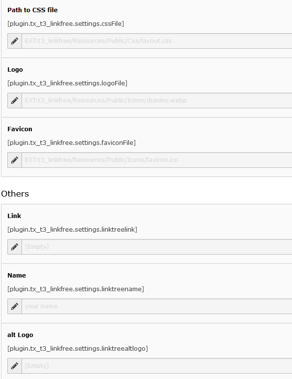

.. include:: ../Includes.txt

.. _configuration:

=============
Configuration
=============

The extension can be configured via the constant editor:

   You can set all needed values via the constant editor.

* Path to CSS file: use your own linkfree-css-file. If set, its used instead of the standard CSS. You might copy the standard-css-file, put it in your sitepackage and change everything  you need to (i.e. colors, fonts...)
* Logo: the image on the top of you linktree
* Favicon: the favicon of your linktree
* Link: used for linking logo and name
* Name: the name you see beneth the logo
* alt Logo: alt-tag of your logo
* usespaceless: if checked, redundant spaces between HTML tags are removed. So the output is a bit smaller. Is checked by default
