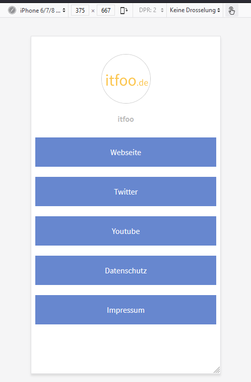

.. include:: ../Includes.txt

.. _introduction:

============
Introduction
============

What does it do?
================

Adds a simple method to create "linktrees" (see screenshot below) and customizethem in your own style.
Linktress can be used in social media profiles to make all needed links available within one link.

It is based on https://github.com/MichaelBarney/LinkFree
Have a look at templates there. You can easily adopt these template by using the corresponding css-file or implement your own style.

See :ref:`Configuration <configuration>`

.. _screenshots:

Screenshots
===========

.. figure:: ../Images/Examples/example_linkfree.png
   :class: with-shadow
   :alt: Basic example
   :width: 806px

   Basic style without configuration (desktop)

   a real world example (mobile)

   another real world example (mobile)

The screenshots show how the frontend could look like.
